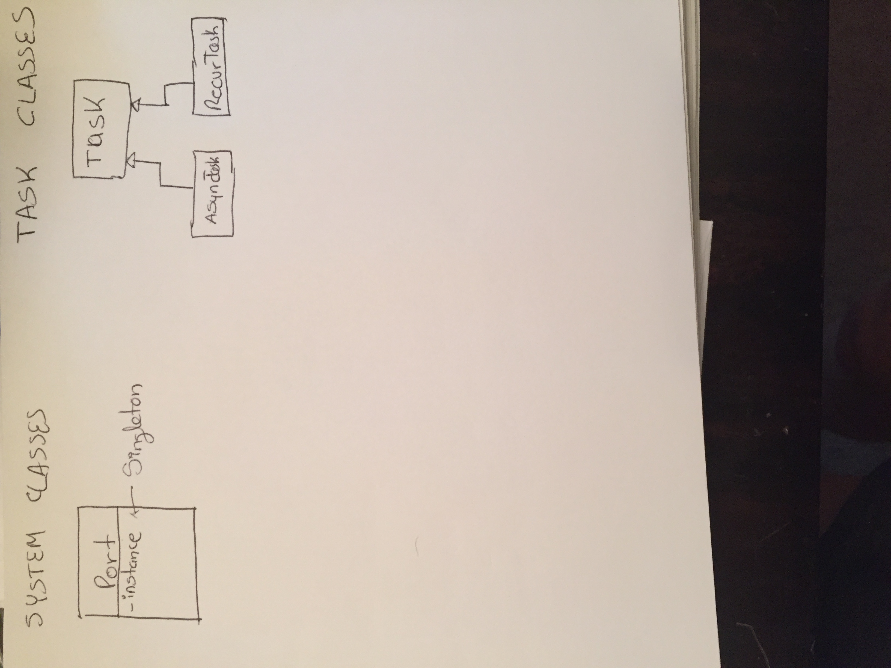

# ClearMetal Take home project

## Intro
- There were a lot of questions needed to be asked, but in service of time, I made some assumptions.
- I will list the questions that I would have, and then my assumption.
- I took a more time than the two hours asked because I wanted this opportunity to brush up with some concepts I used to work with.
- I tried to do a lean central system called port. It takes care of the scheduling of the tasks.
- All the information: dependencies, recurrence task timer values, etc is contained in each task.
- I tried to do a Singleton for the port systems (to keep history of deoendencies), but I had a major logic flow
but left it to show my reasoning. My problem is that I am running .py and then quit.

## Question and Asumptions:
- Would the system be able to handle more than one task at a time?
Assumption: Not for now. But I left a queue and a pool to prepare it to expand it to handle more than one.

- Can there be a misxed of recurring tasks with dependencies?
Assumption: Not for now. I have only two classes of tasks. One that handles recurrences and one that handles dependencies.
        although, the code is prepared to mix both with little change.

- Can there be more than one recurring task at a time.
Assumption: No, but again the code is prepared for it with some change. Right now I am on using a built in scheduler that
        doesn't liberate the main thread. I was taking too long to spawn a new thread for it. That would be the right way of doing it.


## Starting from the Terminal

To try the example application, type the following in the terminal:

```
python port.py
```

It will ask for the name of the script (task) to run.
The choices are: 

* With Dependencies (One-Time):
    task_A_1.1.py, task_A_1.1.py, task_A_1.1.py

* Recurring (and no dependencies)
    task_A_1.1.py

## My Class Diagram



